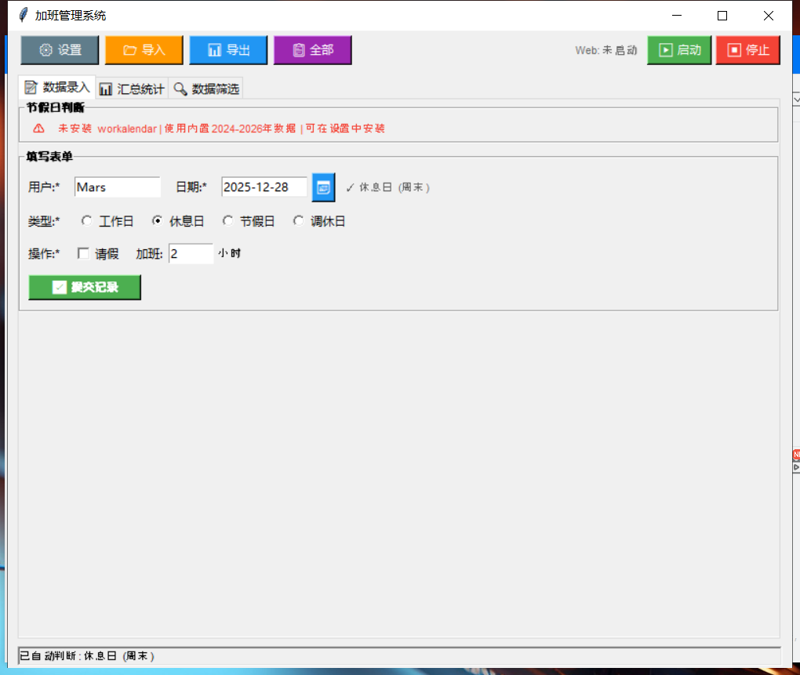
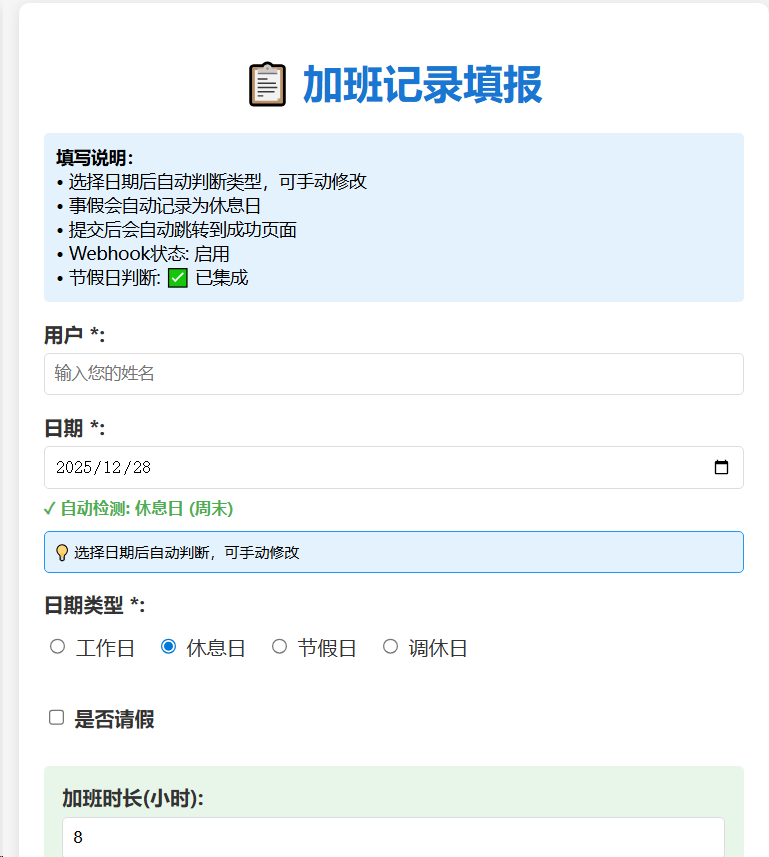

# 加班管理系统 - 使用说明

## 📦项目结构
```markdown
Overtime/
├── scripts/                 # 工具脚本
│   ├── install_deps.py      # 依赖安装
│   ├── check_env.py         # 环境检测
│   └── backup_data.py       # 数据备份
├── core/                    # 核心模块
│   ├── config.py            # 配置管理
│   ├── data_manager.py      # 数据管理
│   └── utils.py             # 工具函数
├── modules/                 # 业务模块
│   ├── holiday.py           # 节假日判断
│   ├── holiday.json         # 节假日本地数据
│   ├── overtime.py          # 加班统计
│   ├── salary.py            # 加班工资计算
│   ├── leave.py             # 请假管理
│   ├── webhook.py           # Webhook推送
│   └── web_service/         # Web服务
│       ├── server.py
│       ├── handlers.py
│       └── templates.py
├── ui/                      # 界面层
│   ├── main_window.py       # 主界面
│   └── settings_dialog.py   # 设置对话框
├── data/                    # 数据目录
│   ├── overtime_records.csv
│   └── backup/
├── docs/                    # 文档
│   ├── README.md
│   └── 使用说明.md
├── config.json              # 配置文件
├── main.py                  # 程序入口
└── requirements.txt         # 依赖清单
```

## 🚀 快速开始

### 1. 环境准备

**安装必需依赖：**
```bash
# 方法一：使用安装脚本（推荐）
python scripts/install_deps.py
# 选择 2 (仅安装必需依赖)

# 方法二：手动安装
pip install tkcalendar
```

**可选依赖（增强功能）：**
```bash
# 节假日判断
pip install chinesecalendar

# 节假日本地数据
下载指定年份的节假日信息Json，更新至/modules/holiday.json内[免费Api](https://www.mxnzp.com/doc/detail?id=1)

# Excel导出
pip install openpyxl
```

**检查环境：**
```bash
python scripts/check_env.py
```

### 2. 首次运行

```bash
python main.py
```

**首次运行会自动创建：**
- `data/` 数据目录
- `data/overtime_records.csv` 数据文件（带表头）
- `config.json` 配置文件

### 3. 界面概览

#### 顶部工具栏
- ⚙️ **系统设置**：配置用户、加班工资、Webhook等
- 📂 **导入**：导入CSV/Excel数据
- 📊 **导出**：导出Excel报表
- 📋 **全部**：查看所有记录
- ▶️ **启动** / ⏹️ **停止**：Web服务控制

#### 标签页功能
**📝 数据录入**
- 用户输入（支持默认用户）
- 日期选择（日历选择器 + 手动输入）
- 📅 点击日历按钮选择日期
- 自动检测类型（选择/输入日期后自动检测）
- 类型选择：工作日/休息日/节假日/调休日
- 操作切换：加班 / 请假
- 请假类型：事假/病假/年假/婚假/产假
- 提交记录

**📊 汇总统计**
- 月度汇总（自动获取当月）
- 总时长统计
- 加班工资汇总（启用加班工资计算时）
- 分类统计：工作日/休息日/节假日/调休时长
- 刷新按钮

**🔍 数据筛选**
- 筛选条件：用户、日期范围、类型
- 分页控制：上一页/下一页/每页条数
- 记录列表：8列数据展示
- 刷新记录

---

## 🎯 核心功能详解

### 1. 智能日期检测

**自动检测：**
- 选择/输入日期后，自动判断类型
- 显示结果：`✓ 节假日 (春节)`
- 3秒后恢复默认颜色

**检测逻辑：**
1. **chinese-calendar模式**：使用第三方库节假日数据
2. **内置模式**：采用第三方Api获取Json数据，支持2026-2026年完整数据（含调休）
3. **基础模式**：根据星期几判断

**支持年份：**
- chinese-calendar：2004-2026
- 内置数据：2025-2026

### 2. 加班记录

**流程：**
1. 填写用户（自动填充默认用户）
2. 选择日期（自动检测类型）
3. 选择类型（可手动修改）
4. 填写加班时长
5. 提交记录

**数据保存：**
- 格式：CSV文件
- 路径：`data/overtime_records.csv`
- 自动创建备份目录

### 3. 请假管理

**请假类型：**
- 事假：可选半天(-4)或全天(-8)
- 病假/年假/婚假/产假：自定义时长

**工时扣除规则（可配置）：**
- 在设置中勾选需要扣除的请假类型
- 勾选后，该类型请假会记录为"休息日"
- 例如：事假勾选后，自动扣除工时

### 4. 加班工资计算

**配置：**
- 小时加班工资：如 50元/小时
- 倍率配置：
  - 工作日：1.5倍
  - 休息日：2.0倍
  - 节假日：3.0倍

**计算公式：**
```
加班工资 = 小时加班工资 × 时长 × 倍率
```

**示例：**
- 工作日加班8小时：50 × 8 × 1.5 =600元
- 休息日加班8小时：50 × 8 × 2.0 = 800元
- 节假日加班8小时：50 × 8 × 3.0 = 1200元

**汇总显示：**
- 月度总加班工资
- 每日加班工资明细
- 分类统计

### 5. Web 服务

**启动：**
- 点击顶部"▶️ 启动"按钮
- 显示服务状态和URL
- 默认端口：8080（可在设置中修改）

**网页端功能：**
- 独立HTML表单
- 日期自动检测
- 支持加班/请假
- 实时提交反馈
- **访问方式：**
- 本机：`http://localhost:8080`
- 局域网：`http://本机IP:8080`
- 查看IP：启动后会显示在底部状态栏


**Webhook推送：**
- 支持飞书、钉钉、企业微信
- 提交后自动推送通知
- 异步发送，不阻塞界面

### 6. 数据管理

**导入数据：**
- 支持 CSV / Excel 格式
- 自动合并到现有数据
- 错误行会跳过并提示

**导出Excel：**
- 带格式化的报表
- 包含表头、数据、样式
- 自动调整列宽

**数据备份：**
```bash
# 手动备份
python scripts/backup_data.py backup

# 列出备份
python scripts/backup_data.py list

# 恢复备份
python scripts/backup_data.py restore overtime_records_20241228_143022.csv
```

**自动备份：**
- 程序会自动在 `data/backup/` 创建备份
- 备份文件名带时间戳

---

## ⚙️ 系统设置

### 基础设置
- **默认用户**：每次打开自动填充
- **默认加班时长**：如8 小时
- **每页记录数**：分页显示数量
- **一键安装**：chinesecalendar / openpyxl

### 请假配置
- **请假类型**：可自定义增删
- **扣除规则**：勾选需要扣除工时的类型
- **说明**：事假通常需要扣除

### 加班工资
- **启用开关**：开启/关闭加班工资计算
- **小时加班工资**：如 50.0 元/小时
- **倍率配置**：
  - 工作日倍率：1.5
  - 休息日倍率：2.0
  - 节假日倍率：3.0

### 节假日数据
- **数据源选择**：支持内置数据源与Chinese_Calendar数据源切换
- **获取Json**：跳转至第三方网站通过Api获取全年Json信息
- **安装依赖**：点击一键安装Chinese_Calendar依赖包

### Web服务/Webhook
- **服务端口**：如 8080
- **Webhook平台**：支持飞书/钉钉/企业微信/Lark/Slack等国内外多个平台，并且支持自定义Webhook
- **Webhook URL**：Webhook地址
- **超时时间**：请求超时秒数
- **重试次数**：失败重试次数
- **同步模式**：sync/async
- **测试连接**：验证Webhook可用性

---

## 📊 数据流程

```
用户输入 → 界面验证 → 业务处理 → 数据存储 → Webhook通知
   ↓        ↓         ↓        ↓         ↓
表单数据   格式检查   加班工资计算   CSV文件    飞书/钉钉/企业微信/Lark/Slack/自定义
```

**详细步骤：**
1. **输入阶段**：用户填写表单
2. **验证阶段**：检查必填项、日期格式
3. **检测阶段**：自动判断日期类型
4. **计算阶段**：根据配置计算加班工资
5. **提交阶段**：保存到CSV文件
6. **同步阶段**：异步发送Webhook（如果启用）

---

## 🔧 配置文件详解

### config.json

```json
{
  "last_user": "",
  "default_hours": "8",
  "page_size": 10,
  "web_port": 8080,
  "leave_types": ["事假", "病假", "年假", "婚假", "产假"],
  "deduct_rest_day_hours": true,
  "overtime_pay": {
    "enabled": false,
    "hourly_wage": 50.0,
    "weekday_rate": 1.0,
    "weekend_rate": 1.5,
    "holiday_rate": 2.0,
    "deduct_types": ["事假"]
  },
  "webhook": {
    "enabled": false,
    "url": "",
    "headers": "{}",
    "timeout": 10,
    "retry": 3,
    "sync_mode": "sync"
  },
  "modules": {
    "overtime": true,
    "salary": true,
    "leave": true,
    "webhook": true,
    "web_service": true,
    "holiday": true
  }
}
```

### 参数说明

| 参数 | 说明 | 默认值    |
|------|------|--------|
| `last_user` | 默认用户 | ""     |
| `default_hours` | 默认加班时长 | "8"    |
| `page_size` | 每页记录数 | 10     |
| `web_port` | Web服务端口 | 8080   |
| `leave_types` | 请假类型列表 | 5种     |
| `deduct_rest_day_hours` | 是否扣除休息日工时 | true   |
| `overtime_pay.enabled` | 是否启用加班工资计算 | false  |
| `overtime_pay.hourly_wage` | 小时加班工资（元） | 50.0   |
| `overtime_pay.weekday_rate` | 工作日倍率 | 1.5    |
| `overtime_pay.weekend_rate` | 休息日倍率 | 2.0    |
| `overtime_pay.holiday_rate` | 节假日倍率 | 3.0    |
| `overtime_pay.deduct_types` | 扣除工时的请假类型 | ["事假"] |
| `webhook.enabled` | 是否启用Webhook | false  |
| `webhook.url` | Webhook地址 | ""     |
| `webhook.timeout` | 超时时间（秒） | 10     |
| `webhook.retry` | 重试次数 | 3      |
| `webhook.sync_mode` | 同步模式 | "sync" |

---

## 📈 使用场景示例

### 场景1：日常加班记录

**操作步骤：**
1. 打开程序（自动填充今天日期）
2. 输入用户名（如"张三"）
3. 点击📅选择日期（或直接输入）
4. 系统自动检测：`✓工作日 (工作日)`
5. 填写加班时长：8
6. 点击"提交记录"
7. 成功提示：加班工资（如果启用）

**数据查看：**
- 切换到"汇总统计"标签页
- 查看当月统计
- 点击"刷新"

### 场景2：请假管理

**操作步骤：**
1. 勾选"请假"选项
2. 选择请假类型：
   - **事假**：选择半天/全天
   - **其他**：填写时长
3. 点击"提交记录"

**工时处理：**
- 如果事假在扣除规则中：
  - 记录为"休息日"
  - 工时为负数（-4或-8）
- 如果不在规则中：
  - 保持原类型
  - 工时为0

### 场景3：网页端填报

**启动服务：**
1. 点击"▶️ 启动"按钮
2. 记录显示的URL（如 `http://192.168.1.1:8080`）

**访问填报：**
1. 手机/电脑浏览器访问URL
2. 填写表单
3. 自动检测日期类型
4. 提交后显示成功页面

**数据同步：**
- 自动保存到本地CSV
- 如果启用Webhook，自动推送通知

### 场景4：团队使用

**管理员配置：**
1. 设置Webhook URL（飞书/钉钉机器人）
2. 配置小时加班工资和倍率
3. 告知团队成员网页端地址

**团队成员：**
1. 通过网页端每日填报
2. 无需安装程序

**月末统计：**
1. 管理员打开桌面程序
2. 筛选当月数据
3. 导出Excel报表
4. 发送给财务

---

## 🛡️ 数据安全

### 本地存储
- 所有数据保存在本地CSV文件
- 无云端依赖，数据完全私有

### 自动备份
- 每次启动自动创建备份
- 备份目录：`data/backup/`
- 文件名：`overtime_records_YYYYMMDD_HHMMSS.csv`

### 手动备份
```bash
python scripts/backup_data.py backup
```

### 恢复数据
```bash
#先查看备份列表
python scripts/backup_data.py list

# 恢复指定备份
python scripts/backup_data.py restore overtime_records_20241228_143022.csv
```

---

## 📝 CSV文件格式

**文件路径：** `data/overtime_records.csv`

**表头：**
```
日期,用户,类型,加班时长,请假类型,请假时长,提交时间,加班工资
```

**示例数据：**
```csv
2024-01-04,张三,调休日,8,无,无,2024-01-04 14:30:22,400.00元
2024-01-05,李四,工作日,4,无,无,2024-01-05 09:15:10,200.00元
2024-01-06,王五,休息日,0,事假,-8,2024-01-06 10:20:30,0元
```

**字段说明：**
- **日期**：YYYY-MM-DD- **用户**：姓名
- **类型**：工作日/休息日/节假日/调休日
- **加班时长**：加班时长（正数）或请假时长（负数）
- **请假类型**：事假/病假/年假/婚假/产假/无
- **请假时长**：如 "-8"
- **提交时间**：YYYY-MM-DD HH:MM:SS
- **加班工资**：如 "400.00元"

---

## 🐛 常见问题

### Q1:启动报错 "ModuleNotFoundError: No module named 'tkcalendar'"
**解决：**
```bash
python scripts/install_deps.py
# 选择 2 (仅安装必需依赖)
```

### Q2: 节假日判断不准确
**原因：** 未安装chinesecalendar或内置数据不全**解决：**
```bash
pip install chinesecalendar
```
或手动在 `modules/holiday.py` 中添加更多节假日数据

### Q3: 网页端无法访问
**检查：**
1. 防火墙是否开放8080端口
2. 是否正确启动服务（查看状态栏）
3. 使用本机IP而非localhost

**获取本机IP：**
```bash
# Windows
ipconfig

# Linux/Mac
ifconfig
```

### Q4: 数据丢失怎么办
**恢复：**
```bash
# 查看备份
python scripts/backup_data.py list

# 恢复最新备份
python scripts/backup_data.py restore <最新备份文件名>
```

### Q5: 如何修改加班工资倍率
**方法一：设置界面**
1. 点击"⚙️ 设置"
2. 切换到"加班工资"标签
3. 修改倍率
4. 保存并关闭

**方法二：编辑配置**
1. 关闭程序
2. 编辑 `config.json`
3. 修改 `overtime_pay` 相关字段
4. 重新启动

### Q6: Webhook推送失败
**检查：**
1. URL是否正确
2. 网络是否通畅
3. 使用"测试Webhook连接"功能
4. 查看重试次数和超时设置
5. 钉钉添加Webhook机器人时可以设置安全关键词"加班"

### Q7: 导出Excel失败
**解决：**
```bash
pip install openpyxl
```

### Q8: 如何添加更多年份的节假日
**修改：** `modules/holiday.py` 中的 `self.holidays` 字典

**格式：**
```json
"2025": {
    "01-01": ("节假日", "元旦"),
    "02-XX": ("节假日", "春节"),
    # ... 更多日期
}
```

---

## 💡 使用技巧

### 技巧1：快速填报
- 设置默认用户
- 程序启动自动填充今天日期
- 直接填写时长提交

### 技巧2：批量导入
- 准备CSV文件（参考格式）
- 点击"导入"按钮
- 自动合并到现有数据

### 技巧3：网页端快速访问
- 启动服务后，右键点击URL复制
- 发送到手机/其他电脑
- 保存为浏览器书签

### 技巧4：数据筛选
- 只填"用户"：查看某人所有记录
- 只填"日期范围"：查看某段时间
- 组合筛选：精确查找

### 技巧5：加班工资统计
- 先在设置中启用加班工资计算
- 配置小时加班工资和倍率
- 提交记录时自动计算
- 在汇总页查看总加班工资

---

## 📞技术支持

### 问题反馈
- GitHub Issues
- 提供错误截图和日志

### 功能建议
- 欢迎提交 Pull Request

### 更新日志
- 查看项目 commit记录
- 关注重大版本更新

---

## 🎓 高级功能

### 自定义Webhook
```json
# 在系统设置中配置
{
  "webhook": {
    "enabled": true,
    "url": "https://your-webhook-url.com",
    "headers": "{\"Authorization\": \"Bearer token\"}",
    "timeout": 15,
    "retry": 5,
    "sync_mode": "async"
  }
}
```

### 数据库集成（扩展）
可修改 `data_manager.py` 支持：
- MySQL
- SQLite
- MongoDB

### 多语言支持
可修改 `ui/main_window.py`：
- 添加语言切换
- 支持中英文

### API接口
Web服务提供：
- `GET /api/data` - 获取数据
- `POST /api/submit` - 提交记录
- `GET /api/check_date?date=2024-01-01` - 检测日期

---

## 📄许可证

MIT License

---

## 🤝贡献

欢迎贡献代码、文档或建议！

---

## 💖致谢

**Xiaomi MiMo 大模型提供相关优化方案及代码建议，感谢Xiaomi**
